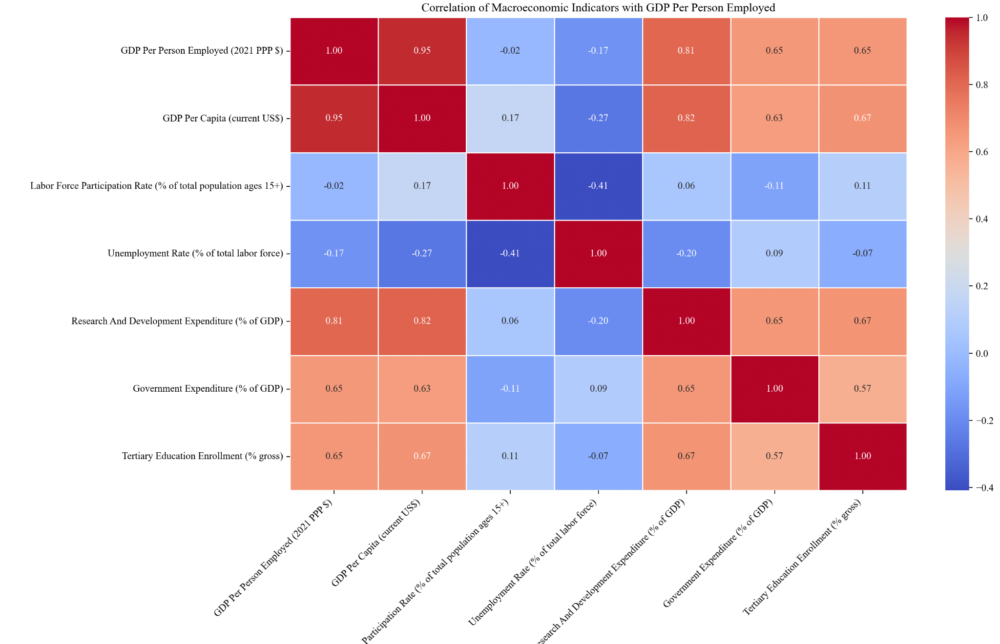
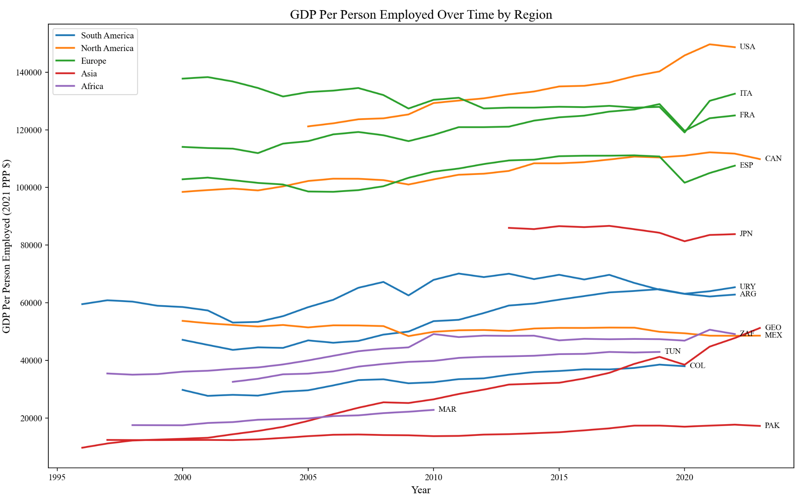
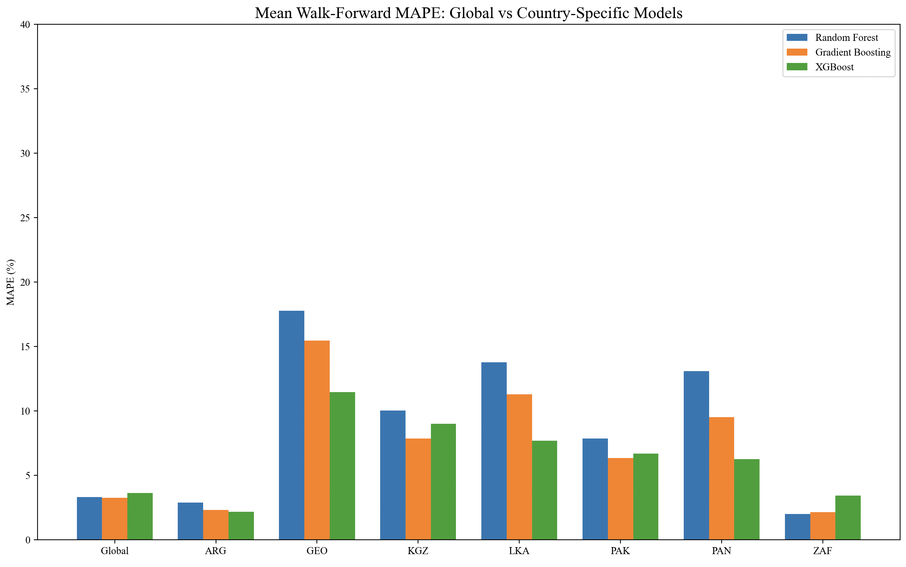
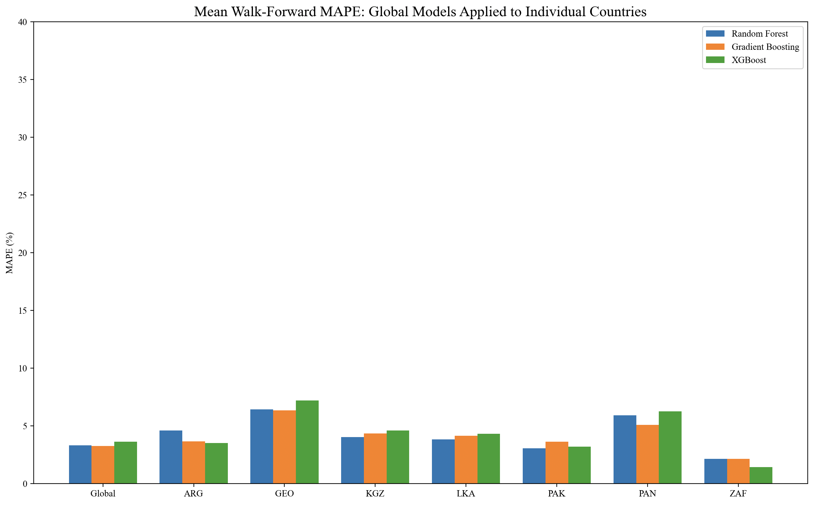

# Labor Productivity Prediction from Macroeconomic Indicators

## About The Project

This project builds an end-to-end data pipeline to analyze and predict **GDP per person employed** using macroeconomic indicators from the **World Bank** and **IMF**.  

It integrates data collection, preprocessing, visualization, and machine learning tree-based regression models. The modeling component compares three settings:

- **Global pooled models** trained on all countries jointly  
- **Country-specific models** trained separately for each country  
- **Global-to-country models**, where global models are evaluated on individual countries to assess cross-country generalization  

The final outputs include:
- Correlation heatmaps and scatter plots examining relationships between macroeconomic indicators
- Time series comparisons across countries and regions
- Visualizations comparing model performance across modeling strategies

---

## Built With

This project was built using:

- **Python**
- **requests** – API data collection
- **pandas** & **numpy** – data manipulation and preprocessing
- **matplotlib** & **seaborn** – data visualization
- **scikit-learn** – Random Forest and Gradient Boosting regression models
- **xgboost** – XGBoost regression model

---

## Getting Started

Follow the steps below to run the project locally.

### Prerequisites

- Python 3+ recommended
- pip package manager

The World Bank and IMF APIs used in this project are **public** and do not require API keys.

### Installation

1. Clone the repository
   ```sh
   git clone https://github.com/your_github_username/repo_name.git
   ```

2. Navigate to the project directory
   ```sh
   cd your-repo-name
   ```

3. Install the required packages (if you have not already)
   ```sh
   pip install -r requirements.txt
   ```

4. Run the full pipeline
   ```sh
   python -m src.main
   ```

---

## Usage

This pipeline is organized into four modules:

- **src/preprocessing.py** – data collection and preprocessing
- **src/visualization.py** – exploratory and performance visualizations
- **src/model.py** – model training and evaluation
- **src/main.py** – pipeline execution

The pipeline follows a clear, sequential workflow:

1. Fetch and preprocess macroeconomic indicators from the World Bank and IMF  
2. Generate exploratory visualizations (correlation heatmaps, scatter plots, time series)  
3. Train and evaluate machine learning models under three modeling strategies:  
   - Global pooled models  
   - Country-specific models  
   - Global pooled models applied to individual countries  
4. Display grouped bar charts comparing MAPE across modeling strategies

---

## Results & Visualizations

### Exploratory Data Analysis

**Spearman correlation heatmap** showing relationships between GDP per person employed and selected macroeconomic indicators.

<p align="center">
  
</p>

**Standardized scatter plot** illustrating the strong positive relationship between GDP per person employed and GDP per capita.

<p align="center">
  
</p>

<br>

### Labor Productivity Trends Across Regions

Time series of GDP per person employed across selected countries, grouped by region, highlighting regional productivity gaps and long-run trends.

<p align="center">
  
</p>

<br>

### Model Performance Comparison

MAPE comparison between global pooled models and country-specific models.

<p align="center">
  
</p>

Global pooled models evaluated on each country’s holdout set to assess cross-country generalization.

<p align="center">
  
</p>

---

## Acknowledgments

- World Bank Data APIs
- IMF DataMapper API
- requests, pandas, numpy, matplotlib, seaborn, scikit-learn, xgboost documentation and open-source contributors

---
